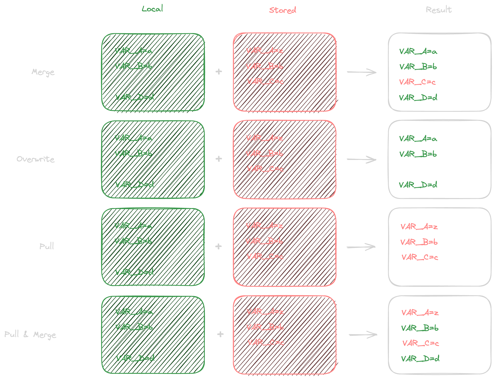

# apispec

Version 1.x.x

## Protocols:

### Init

1. The agent contacts `POST:/api/init`.
2. The authority responds with an `@InitResponse` object.
3. The user is redirected to the `redirect_url`, where they may create a project.
4. The agent begins polling `url` (`GET:/api/init/:id`) for the project status.
5. The authority responds with an `@InitStatusResponse` object.
6. Upon creation, the response's `status` is `done`, and the `project_url` is provided.

### Link

1. The agent redirects the user to `GET:/api/projects/:project_id/link/:iv`, where `iv` is the initialisation vector.
2. The agent begins polling `POST:/api/projects/:project_id/link/:iv` for the project status.
3. The authority responds with an `@LinkResponse` object.
4. Upon success, the response's `success` is `true`, and the `bearer` and `public` keys are provided.
5. The agent stores the keys for later use.

### Sync

1. The agent compiles the envdata into a JSON object with the following structure:

```ts
{
    [`${filepath}`]: `${filecontent}`
}
```

2. The agent stringifies the object and splits it into chunks of 255 characters.
3. The agent encrypts each chunk with the `public` key.
4. The agent joins the encrypted chunks into a single string with a delimiter of `::`.
5. The agent contacts `POST:/api/projects/:project_id/sync?strategy=<?SyncStrategy>`, authenticated with the `bearer` key, and with the encrypted chunks as the body.
6. The authority responds with a body in the same format, containing updated values. At the end of the body, a `\n\r\n` sequence followed by newline-terminated strings contains `messages` which may be shown to the user.
7. The agent decrypts the chunks and joins them into a single string.
8. The agent parses the string into a JSON object.
9. The agent writes the new envdata.

## Schemas:

### @InitResponse

```ts
interface InitResponse {
	id: string;
	url: string;
	redirect_url: string;
	timestamp: number;
	interval?: number;
}
```

### @InitStatusResponse

```ts
interface InitStatusResponse {
	status: 'done' | 'pending';
	timestamp: number;
	project_url?: string;
	interval?: number;
}
```

### @LinkResponse

```ts
interface LinkResponse {
	success?: boolean;
	error?: string;
	bearer?: string;
	public?: string;
}
```

## Types:

### SyncStrategy

```ts
type SyncStrategy = 'merge' | 'overwrite' | 'pull' | 'pull-merge';
```


